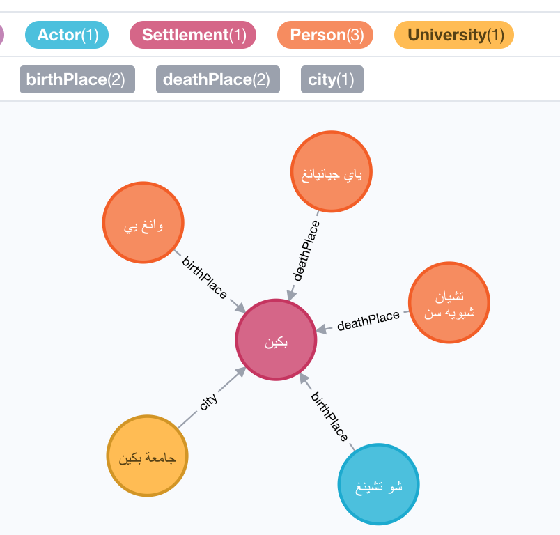

# jessica_dbpedia_arabic

## start the service

```bash
docker pull gaoyuanliang/jessica_dbpedia_arabic:1.0.1

docker run -it \
-p 5987:5987 \
-p 4522:4522 \
-p 8865:8865 \
-p 6887:9000 \
-v /Users/Jim/Downloads/:/Downloads/ \
gaoyuanliang/jessica_dbpedia_arabic:1.0.1 
```

## how to use it

rest api input interface: http://0.0.0.0:6887/
neo4j output interface: http://0.0.0.0:5987/browser/


### example 1

input:

```python
{
  "text": "أسافر من جدة إلى مكة"
}
```

output:


### example 2

input:

```python
{
  "text": "أعيش في بكين"
}
```

output:


