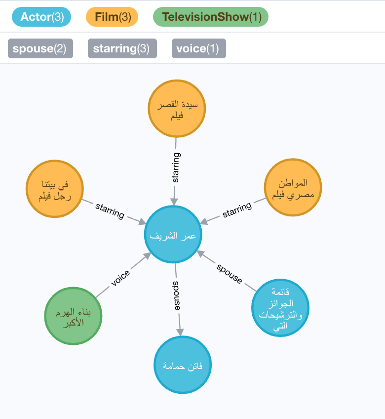
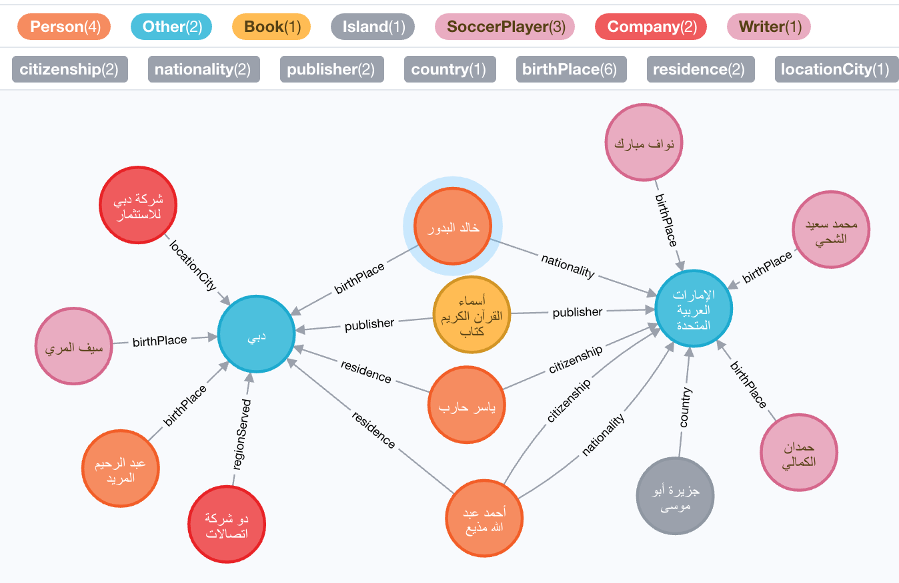

# Jessica's Arabic Knowledge Graph Engine

## start the service

```bash
docker pull gaoyuanliang/jessica_dbpedia_arabic:1.0.1

docker run -it \
-p 5987:5987 \
-p 4522:4522 \
-p 8865:8865 \
-p 6887:9000 \
gaoyuanliang/jessica_dbpedia_arabic:1.0.1 
```

## how to use it

rest api input interface: http://0.0.0.0:6887/

neo4j output interface: http://0.0.0.0:5987/browser/


### example 1

input:

```python
{
  "text": "عمر الشريف ممثل سينمائي"
}
```

output:



### example 2

input:

```python
{
  "text": "دبي هي أكبر مدينة في الإمارات العربية المتحدة"
}
```

output:



## Architecture 

The architecture of this engine is introduced in my blog https://gaoyuanliang614.medium.com/jessicas-arabic-knowledge-graph-linking-engine-e83babe38b79

## Contact

I am Jessica Liang, an MS student at Heriot-Watt University Dubai. I will graduate next year, 2021, and be looking for a data scientist/AI engineer/solution job. If you have such openings, please contact me by email, gaoyuanliang@outlook.com
